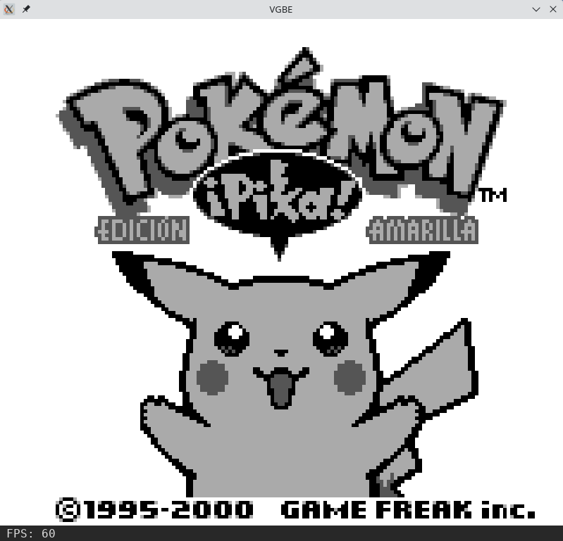
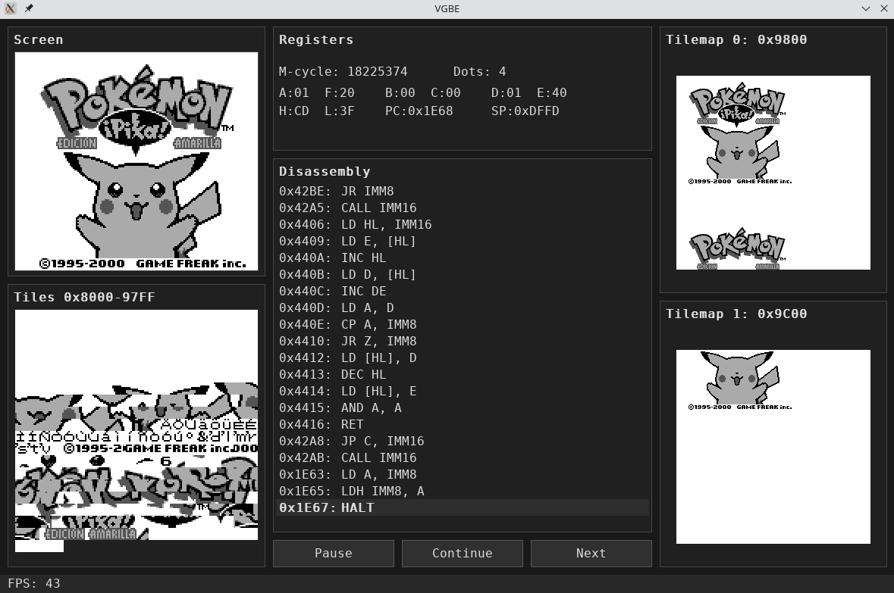

# VGBE

## Vicente's Game Boy Emulator

VGBE is a Game Boy emulator written in Rust as a final grade project. It includes a native SDL frontend, normal and debug execution modes, keyboard controls, TAS input playback, and native audio support through the included APU integration.

## Cloning VGBE

VGBE uses an external library for the audio subsystem, and the git repository is added as a submodule. To clone this repository with the audio library use:
```bash
git clone --recursive <repo-url>
```

## User Manual

### Compile The Emulator

To compile and run the emulator, first install:

- Rust and Cargo.
- SDL2 development libraries.
- SDL2_ttf development libraries.
- A C/C++ compiler toolchain for the native APU build.


From the project root, compile the release build with Cargo:

```bash
cargo build --release
```

For a faster debug build during development, run:

```bash
cargo build
```

After compiling with `cargo build --release`, the emulator binary is located at:

```text
target/release/vgbe
```

### Command Line Options

```text
vgbe <rom> [--debug=true|false] [--tas=<file>]
```

- `<rom>` is the path to the Game Boy ROM to execute.
- `--debug=true` starts the emulator in debug mode. This is the default when the option is omitted.
- `--debug=false` starts the emulator in normal mode.
- `--tas=<file>` loads a TAS input file. When TAS playback is enabled, live Game Boy button key presses are ignored so playback remains deterministic.


### Run With Cargo

The emulator can also be compiled and executed directly with Cargo:

```bash
cargo run --release -- <rom> [--debug=true|false] [--tas=<file>]
```

For a development build:

```bash
cargo run -- <rom> [--debug=true|false] [--tas=<file>]
```


## Emulator Modes

### Normal Mode

Normal mode shows only the emulated Game Boy screen and status bar. It is the recommended mode for playing games.

Start directly in normal mode with:

```bash
vgbe <rom> --debug=false [--tas=<file>]
```



### Debug Mode

Debug mode shows the Game Boy screen together with emulator inspection panels. It includes CPU registers, disassembly, tiles, tilemaps, cycle information, and execution controls.

Debug mode is the default startup mode:

```bash
vgbe <rom>
```

It can also be selected explicitly:

```bash
vgbe <rom> --debug=true [--tas=<file>]
```



Press `F1` at any time to switch between normal mode and debug mode.

## Controls

### Emulator Controls

| Key | Action |
| --- | --- |
| `Esc` | Quit the emulator |
| `F1` | Toggle between normal mode and debug mode |
| `P` | Pause emulation |
| `C` | Continue emulation |
| `N` | Execute the next step while paused |
| Left mouse button | Click debug buttons: Pause, Continue, Next |

### Game Boy Controls

| Keyboard key | Game Boy button |
| --- | --- |
| `W` or `Up Arrow` | D-pad Up |
| `A` or `Left Arrow` | D-pad Left |
| `S` or `Down Arrow` | D-pad Down |
| `D` or `Right Arrow` | D-pad Right |
| `K` | A |
| `L` | B |
| `I` | Start |
| `O` | Select |

## TAS File Format

A TAS file is a plain text file. Each non-empty line defines one input event with this format:

```text
<cycle> <key> <0|1>
```

- `<cycle>` is the emulator CPU cycle/M-cycle where the event is applied.
- `<key>` is one of `w`, `a`, `s`, `d`, `k`, `l`, `i`, or `o`.
- `1` means the key is pressed.
- `0` means the key is released.

Example:

```text
100 w 1
140 w 0
200 k 1
260 k 0
500 i 1
540 i 0
```

This example presses Up at cycle `100`, releases it at cycle `140`, presses A at cycle `200`, releases it at cycle `260`, presses Start at cycle `500`, and releases it at cycle `540`.

Empty lines are allowed. Comments are not currently supported.
